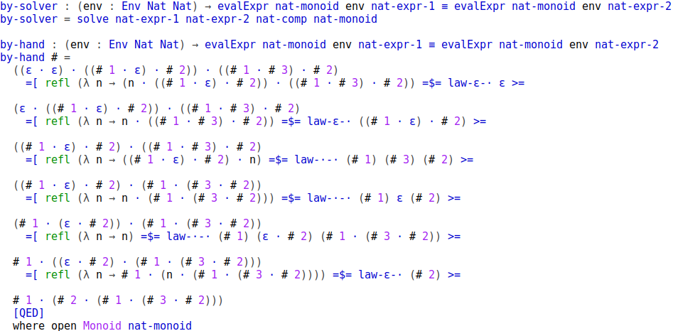

# Agda

- Dependently typed

- Functional

- Total

- Proof automation: No tactics, reflection

# Theorem proving

- Proposition: type $T$ \newline
  Proof instance: value $v : T$

- Types are checked at compile time: \newline
  Correctness guaranteed statically

# Aim

Write programs that compute proofs for:

- Monoids **[implemented]**
- Commutative rings **[understood]**
- Presburger arithmetic **[prelude]**
- Categories **[?]**

# Monoids

- A set together with:
    - a binary operation that:
        - is associative
        - has an identity element which is absorbed on either side
        
- e.g., $(\mathbb{N}, +)$, $(\mathbb{N}, \cdot)$, $\forall \texttt{T} . (\texttt{List T}, \oplus)$

- $x + (y + 0) + ((0 + x) + y) \stackrel{?}{=} ((x + y) + x) + y$

- Lists are their canonical form

----

Solving a simple monoid, with and without a solver

 \

# Equality of canonical forms

Strategy to solve equations on monoids and commutative rings.

- Define:
    - the *source theory* of expressions $S$

    - an evaluation function $e_S : S \rightarrow T$

    - a canonical form $N$

    - a normalising function $n : S \rightarrow N$

    - an evaluation function $e_N : N \rightarrow T$

- Proof that $\forall x : S \rightarrow e_N \, (n \, x) \equiv e_S \, x$ \newline
  Then $\forall x y : S \rightarrow n \,x \equiv n \, y \implies e_S \, x \equiv e_S \, y$

# Commutative rings

- A set together with:
    - an addition operation that:
        - is associative
        - is commutative
        - has an identity element which is absorbed
        - has an inverse
    - a multiplication operation that:
        - is associative
        - is commutative
        - has an identity element which is absorbed
    - where multiplication is distributive with respect to addition

- e.g., $(\mathbb{N}, +, \cdot)$

- $2 \cdot (2x + 3 \cdot (x + y)) - x \cdot (y + 10) \stackrel{?}{=} (-x + 6)
  \cdot y$

- Horner normal form together with some normalisation constraints yields a
  canonical form

# Presburger arithmetic

- Theory of natural numbers with addition and equality, logical connectives and
  existential qualifiers.

- $\forall x . \forall y . \exists z . (x = y + z \land (z > 0 \implies x > y))$

- Algorithm:
    - *Fourier-Motzkin* ($\mathbb{R}$, DNF); *Omega Test* ($\mathbb{Z}$, DNF);
      *Cooper's Algorithm* ($\mathbb{Z}$, no DNF)

    - Proceed eliminating inner quantifiers until none left

    - $\forall x . P x \equiv \neg (\exists x . \neg (P x))$

    - If in $\mathbb{Z}$, then $x \leq y \equiv x < y + 1$

# Roadmap

- Decide on which algorithm to use for Presburger. Then:
    1. Translate the algorithm into Agda
    2. Benefit from dependent typing
    3. Prove correctness
    4. Try to make it an addition to Agda-Stdlib

- Better understand the nature and extent of our categorical equation solver.
  Then:
    1. Decide whether to implement one

# Evaluation

- Correctness ultimately guaranteed by the typechecker

- Compare solutions to existing software in other languages

- Apply solvers to real-life problems

- Compare strategies across solvers
